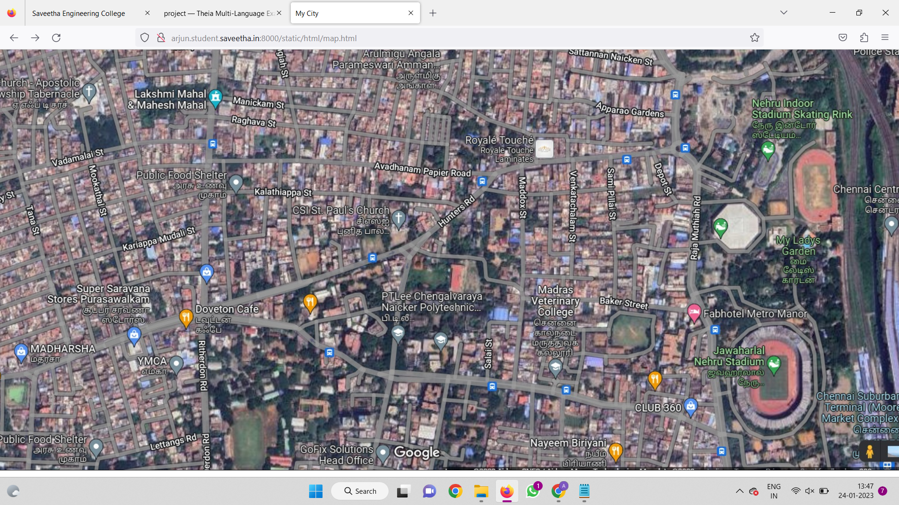
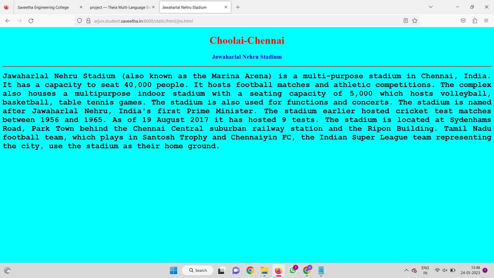
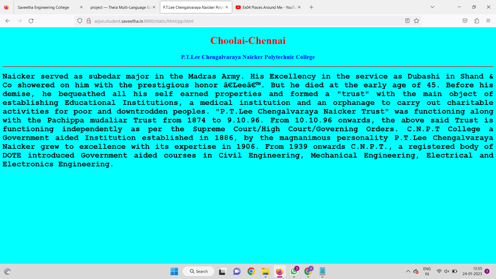
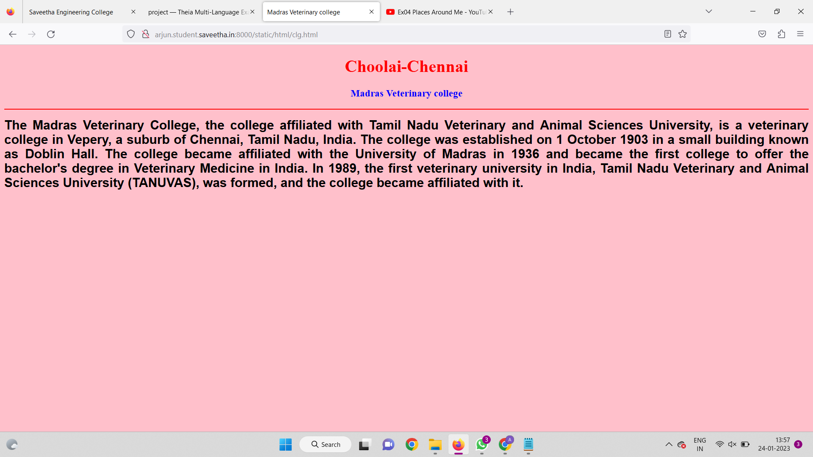
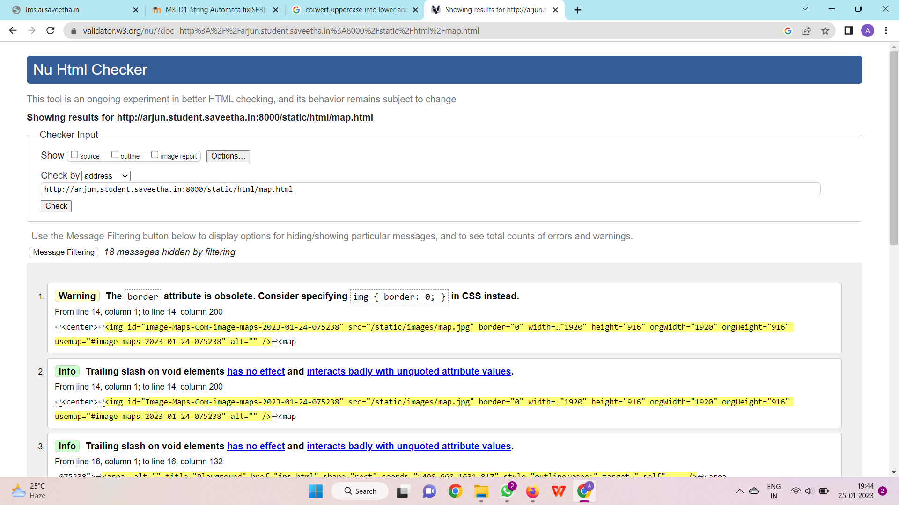

# Places Around Me
## AIM:
To develop a website to display details about the places around my house.

## Design Steps:

### Step 1:
clone the github repository into theia IDE.
### Step 2:
create a new django project.
### Step 3:
write the neccessary HTML code
### Step 3:
Run the django server and execute the HTML files
## Code:
```
map.html

<!DOCTYPE html>
<html lang="en">
<head>
<title>My City</title>
</head>
<body>
<h1 align="center">
<font color="red"><b>Choolai- chennai</b></font>
</h1>
<h3 align="center">
<font color="blue"><b>M.ARJUN (22008750)</b></font>
</h3>
<center>

<map name="image-maps-2023-01-24-075238" id="ImageMapsCom-image-maps-2023-01-24-075238">
<area  alt="" title="Playground" href="jns.html" shape="rect" coords="1490,668,1631,817" style="outline:none;" target="_self"     />
<area  alt="" title="Madras vertinary college" href="clg.html" shape="rect" coords="1143,638,1255,744" style="outline:none;" target="_self"     />
<area  alt="" title="P.T.Lee Chengalvaraya Naicker Polytechnic College" href="pp.html" shape="rect" coords="956,556,1052,651" style="outline:none;" target="_self"     />
<area shape="rect" coords="1918,914,1920,916" alt="Image Map" style="outline:none;" title="Super Saravana Stores"  href="ss.html />
<area  alt="" title="" href="http://www.image-maps.com/" shape="poly" coords="454,677,454,677,454,677,454,677,454,677,454,677,454,677,454,677,454,677,454,677,454,677,454,677,454,677,454,677,454,677,454,677" style="outline:none;" target="_self"     />
</map>
</center>
</body>
</html>

jns.html

<!DOCTYPE html>
<html lang="en">
<head>
<title>Jawaharlal Nehru Stadium</title>
</head>
<body bgcolor="cyan">
<h1 align="center">
<font color="red"><b>Choolai-Chennai</b></font>
</h1>
<h3 align="center">
<font color="blue"><b>Jawaharlal Nehru Stadium</b></font>
</h3>
<hr size="3" color="red">
<p align="justify">
<font face="Courier New" size="5">
<b>
Jawaharlal Nehru Stadium (also known as the Marina Arena) is a multi-purpose stadium in Chennai, India.
It has a capacity to seat 40,000 people.
It hosts football matches and athletic competitions.
The complex also houses a multipurpose indoor stadium with a seating capacity of 5,000 which hosts volleyball, basketball, table tennis games. The stadium is also used for functions and concerts.
The stadium is named after Jawaharlal Nehru, India's first Prime Minister. The stadium earlier hosted cricket test matches between 1956 and 1965.
As of 19 August 2017 it has hosted 9 tests.
The stadium is located at Sydenhams Road, Park Town behind the Chennai Central suburban railway station and the Ripon Building.
Tamil Nadu football team, which plays in Santosh Trophy and Chennaiyin FC, the Indian Super League team representing the city, use the stadium as their home ground. 
</b>
</font>
</p>
</body>
</html>

pp.html

<!DOCTYPE html>
<html lang='en'>
<head>
    <title>P.T.Lee Chengalvaraya Naicker Polytechnic Colleg</title>
</head>
<body bgcolor="cyan">
    <h1 align="center">
        <font color="red"><b>Choolai-Chennai</b></font>
    </h1>
    <h3 align="center">
        <font color="blue"><b>P.T.Lee Chengalvaraya Naicker Polytechnic College</b></font>
    </h3>
    <hr size="3" color="red">
    <p align="justify">
        <font face="Courier New" size="5">
            <b>
                  Naicker served as subedar major in the Madras Army.
                  His Excellency in the service as Dubashi in Shand & Co showered on him with the prestigious honor ‘Lee’.
			      But he died at the early age of 45. Before his demise, he bequeathed all his self earned properties and formed a "trust" with the main object of establishing Educational Institutions,
                  a medical institution and an orphanage to carry out charitable activities for poor and downtrodden peoples.
                  "P.T.Lee Chengalvaraya Naicker Trust" was functioning along with the Pachippa mudaliar Trust from 1874 to 9.10.96. From 10.10.96 onwards,
			      the above said Trust is functioning independently as per the Supreme Court/High Court/Governing Orders.
                  C.N.P.T College a Government aided Institution established in 1886, by the magnanimous personality P.T.Lee Chengalvaraya Naicker grew to excellence with its expertise in 1906.
                  From 1939 onwards C.N.P.T., a registered body of DOTE introduced Government aided courses in Civil Engineering, Mechanical Engineering, Electrical and Electronics Engineering. 
            </b>
        </font>
    </p>
</body>
</html>

clg.html

<!DOCTYPE html>
<html lang="en">
<head>
<title>Madras Veterinary college</title>
</head>
<body bgcolor="pink">
<h1 align="center">
<font color="red"><b>Choolai-Chennai</b></font>
</h1>
<h3 align="center">
<font color="blue"><b>Madras Veterinary college</b></font>
</h3>
<hr size="3" color="red">
<p align="justify">
<font face="Arial" size="5">
<b>
The Madras Veterinary College, the college affiliated with Tamil Nadu Veterinary and Animal Sciences University, is a veterinary college in Vepery, a suburb of Chennai, Tamil Nadu, India.
The college was established on 1 October 1903 in a small building known as Doblin Hall.
The college became affiliated with the University of Madras in 1936 and became the first college to offer the bachelor's degree in Veterinary Medicine in India.
In 1989, the first veterinary university in India, Tamil Nadu Veterinary and Animal Sciences University (TANUVAS), was formed, and the college became affiliated with it. 
</b>
</font>
</p>
</body>
</html>

``` 
## OUTPUT:








## HTML VALIDATOR:

## Result:
The program for implementing image map is executed successfully.